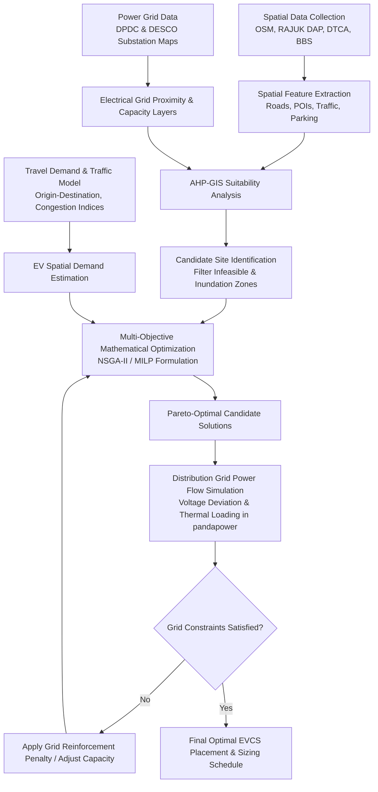

# Optimal Electric Vehicle (EV) Charging Station Placement in Dhaka Metropolitan Area

[](https://opensource.org/licenses/MIT)
[](https://www.python.org/downloads/)
[](https://github.com/)
[]()

---

## 📌 Executive Summary

Urban electrification of transportation is a critical pillar for achieving sustainable development, mitigating severe air pollution, and reducing fossil fuel dependency in rapidly growing megacities. Dhaka, Bangladesh—one of the most densely populated metropolitan areas in the world (>30,000 people/$\text{km}^2$)—faces unique transportation challenges characterized by extreme traffic congestion, mixed traffic streams (2-wheelers, 3-wheelers/easy bikes, commercial fleets, and private passenger cars), high land scarcity, and localized power distribution grid constraints.

This repository contains the complete research framework, spatial datasets, mathematical optimization models, power grid impact simulations, and documentation for **optimal spatial placement and capacity sizing of Electric Vehicle Charging Stations (EVCS) across Dhaka City**.

The framework integrates:
1. **Multi-Criteria Decision Making (MCDM)** based on GIS spatial analysis (AHP & TOPSIS) to identify candidate geographical sites.
2. **Multi-Objective Metaheuristic and Mixed-Integer Linear Programming (MILP)** models (NSGA-II and MCLP/P-Median extensions) to balance charging demand coverage, accessibility, user travel time, and installation costs.
3. **Distribution Grid Power Flow & Reliability Analysis** using `pandapower` to evaluate the impact on Dhaka's power utilities (**DPDC** and **DESCO**) substations and 11kV/33kV distribution feeders.
4. **Heterogeneous Fleet Demand Profiling** specifically calibrated for Dhaka's transport demographics (Electric 2-Wheelers, 3-Wheelers/Easy-Bikes, 4-Wheeler Private EVs, and Electric Fleet/Buses).

---

## 📑 Table of Contents

- [1. Problem Statement & Motivation](#1-problem-statement--motivation)
- [2. Research Objectives](#2-research-objectives)
- [3. Study Area & Geographic Scope](#3-study-area--geographic-scope)
- [4. Theoretical Framework & Methodology](#4-theoretical-framework--methodology)
  - [4.1 Overall Pipeline Architecture](#41-overall-pipeline-architecture)
  - [4.2 Spatial Suitability Modeling (GIS-MCDM)](#42-spatial-suitability-modeling-gis-mcdm)
  - [4.3 Mathematical Optimization Formulation](#43-mathematical-optimization-formulation)
  - [4.4 Power Distribution Network Impact Analysis](#44-power-distribution-network-impact-analysis)
- [5. Vehicle Fleet & Charger Typology](#5-vehicle-fleet--charger-typology)
- [6. Data Sources & Feature Engineering](#6-data-sources--feature-engineering)
- [7. Repository Structure](#7-repository-structure)
- [8. Installation & Environment Setup](#8-installation--environment-setup)
- [9. Execution & Reproducibility Guide](#9-execution--reproducibility-guide)
- [10. Key Results & Insights](#10-key-results--insights)
- [11. Policy Implications & Roadmap for Dhaka](#11-policy-implications--roadmap-for-dhaka)
- [12. Citation & Academic References](#12-citation--academic-references)
- [13. License & Contributors](#13-license--contributors)

---

## 1. Problem Statement & Motivation

Dhaka experiences some of the highest particulate matter ($\text{PM}_{2.5}$ and $\text{PM}_{10}$) concentrations globally, largely driven by internal combustion engine (ICE) vehicular emissions and industrial activity. While the Government of Bangladesh has enacted the **Electric Vehicle Charging Guidelines** and the **Automobile Industry Development Policy (AIDP)** targeting significant EV penetration by 2030, the transition is bottlenecked by:

1. **Severe Space Constraints & Mixed Land Use:** Unlike planned western cities, Dhaka exhibits dense, mixed-use zoning with minimal dedicated public parking infrastructure.
2. **Heterogeneous Vehicle Fleet:** High prevalence of low-speed electric three-wheelers (Easy-bikes) and rapidly rising electric two-wheelers alongside emerging four-wheeler commercial and private fleets, each requiring distinct charging standards (Level 2 AC, DC Fast Charging, and Battery Swapping).
3. **Grid Capacity Bottlenecks:** High transformer loading and localized peak stresses in Dhaka Power Distribution Company (DPDC) and Dhaka Electric Supply Company (DESCO) grids, where uncoordinated EV charging risks feeder overloading, voltage drops, and elevated technical losses.
4. **Congestion-Induced Range Anxiety:** Extreme traffic delays significantly increase auxiliary energy consumption (air conditioning, idling losses), distorting standard travel-distance-to-charging heuristics.

---

## 2. Research Objectives

1. **Spatial Suitability Mapping:** Construct high-resolution ($100\text{m} \times 100\text{m}$ grid) spatial suitability heatmaps across Dhaka North City Corporation (DNCC) and Dhaka South City Corporation (DSCC) using Analytic Hierarchy Process (AHP) and Geographic Information Systems (GIS).
2. **Multi-Objective Optimization:** Formulate and solve a multi-objective optimization problem minimizing total social cost (investment, land acquisition, maintenance, grid reinforcement) and user travel delay while maximizing charging demand coverage.
3. **Power Grid Vulnerability Assessment:** Couple optimal placement results with AC power flow simulations (Newton-Raphson) on 33/11kV distribution substations to ensure voltage stability limits ($\pm 5\%$) and transformer thermal limits are maintained.
4. **Phased Infrastructure Roadmap:** Provide an empirical rollout schedule (Phase 1: 2026–2028, Phase 2: 2029–2032, Phase 3: 2033–2035) calibrated against projected EV adoption curves in Bangladesh.

---

## 3. Study Area & Geographic Scope

The study area encompasses the greater **Dhaka Metropolitan Development Plan (DMDP) / RAJUK Detailed Area Plan (DAP)** zone, with focused optimization on:

* **Dhaka North City Corporation (DNCC):** Gulshan, Banani, Uttara, Mirpur, Mohakhali, Tejgaon, Baridhara, Badda, Mohammadpur.
* **Dhaka South City Corporation (DSCC):** Motijheel, Dhanmondi, Kawran Bazar, Shahbagh, Old Dhaka (Lalbagh, Kotwali, Sutrapur), Jatrabari, Kamrangirchar.
* **Key Strategic Corridors & Transport Gateways:**
  - Airport Road / Dhaka-Mymensingh Highway (N3)
  - Purbachal Expressway (300 Feet) & Pragati Sarani
  - Mirpur Road & Kazi Nazrul Islam Avenue
  - Inter-district Bus & Rail Terminals (Kamalapur, Gabtoli, Mohakhali, Sayedabad)
  - Hazrat Shahjalal International Airport (DAC) Multi-modal logistics hub

```
                       [ Uttara / Tongi Gateway ]
                                  |
                           (Airport Hub)
                                  |
                   [ Mirpur ] -- (Cantonment) -- [ Purbachal / 300ft ]
                       |              |                  |
                   [ Shyamoli ] - [ Mohakhali ] --- [ Gulshan/Banani ]
                       |              |                  |
                 [ Dhanmondi ] - [ Tejgaon/Farmgate ] - [ Badda/Hatirjheel ]
                       |              |                  |
                 [ Mohammadpur ] - [ Shahbagh ] ---- [ Motijheel CBD ]
                                      |                  |
                                [ Old Dhaka ] ---- [ Jatrabari Hub ]
```

---

## 4. Theoretical Framework & Methodology

### 4.1 Overall Pipeline Architecture



---

## Important data-status notice (2026-10-08)

The repository's built-in generator creates **synthetic demonstration data**, not official Dhaka observations. In particular, its `dtca_traffic_counts.csv`, road graph, demand points, land-use polygons, candidate attributes, substation records, and grid model must not be described as DTCA/RAJUK/DPDC/DESCO source data. The default full pipeline now requires public-input provenance sidecars and stops when they are absent; it does not silently generate replacements. `python main.py --mode data` and `python main.py --mode full --data-mode demo` explicitly generate/use synthetic demo inputs only.

### Public-source availability and limits

- **OpenStreetMap roads/POIs:** Bangladesh extracts are downloadable from [Geofabrik](https://download.geofabrik.de/asia/bangladesh.html); OSM data are licensed under [ODbL](https://www.openstreetmap.org/copyright), with attribution and applicable share-alike obligations. Coverage/attributes vary; OSM does not provide measured traffic volumes, vehicle registrations, EV charging demand, or utility capacity.
- **Classified traffic counts:** No open, downloadable Dhaka dataset with verified locations, vehicle classes, measurement dates, and license was confirmed. [DTCA](https://dtca.gov.bd/) is a source to contact, not proof of access to a suitable dataset.
- **Vehicle registrations:** No public location-level registration dataset suitable for neighborhood demand was confirmed. [BRTA](https://brta.gov.bd/) is an authoritative inquiry route; citywide totals cannot be assigned to individual cells.
- **EV charging inventory/demand:** No authoritative open station inventory or observed location-level energy/session dataset was verified. Policy targets or registration totals are not charging-demand measurements.
- **Land use/flood risk:** [RAJUK](https://rajuk.gov.bd/), [BWDB FFWC](https://ffwc.gov.bd/), and [BWDB GIS](https://gis.bwdb.gov.bd/arcgis/home/) are credible leads; editable Dhaka GIS downloads, dataset-specific licenses, dates, coverage, and resolutions were not verified.
- **Distribution grid:** No openly downloadable DPDC/DESCO topology with node-level ratings, actual loads, and spare capacity was verified. Contact [DPDC](https://dpdc.gov.bd/) and [DESCO](https://desco.gov.bd/) for authorized models.

Before any dataset can be treated as observed input, provide a sibling `<filename>.provenance.json` containing `source_url`, `license`, `retrieved_at`, `coverage`, `units`, `transformation`, and `data_class` (`observed`, `official_source`, or `derived_from_observed`). Keep any estimates/scenarios explicitly labeled and out of evidence-based runs. The real-data preflight is an integrity gate, not independent authentication of a source claim; users must verify the source and reuse terms.

### Reproducibility, sensitivity, and exports

A successful pipeline run writes `results/run_manifest.json` (override with the `manifest_path` argument when calling `run_full_pipeline`). It records a run ID and timestamp, real/demo classification, effective merged configuration (including optimizer CLI overrides), source metadata and SHA-256 hashes for inputs/sidecars, hashes for generated outputs, source configuration paths, available package versions, and Git revision when available. Demo runs are marked synthetic. The manifest is written after successful completion; failed runs do not receive a success manifest. Hashes provide content identity, not publisher authentication.

The dashboard's **Download CSV** action in the Pareto chart exports every embedded frontier row. Solution role labels are derived from objective metrics (minimum cost, maximum coverage, knee point), rather than row number. Coverage percentage is calculated as distance/capacity-aware covered demand divided by total supplied demand; it is a modeled score, not observed charging utilization.

Run the optional pipeline-level robustness analysis with `python main.py --mode full --data-mode demo --sensitivity` (omit `--data-mode demo` when verified real inputs are available). This runs additional optimizer cases for ±20% demand, ±20% service radius, and ±10% budget, saving outputs under `results/sensitivity/<run-id>/`. These additional optimizer runs can take substantial time. They are model sensitivity scenarios, not forecasts or observed data; they do not rerun GIS, routing, or grid power-flow stages. The lower-level `src.optimization.sensitivity.run_sensitivity(...)` API also supports explicit `charger_mix` cases.

Each successful pipeline run writes `results/tables/baseline_comparison.csv` and a run-specific `results/reports/run_<run-id>.md`. The baseline file compares the NSGA-II knee solution with TOPSIS-ranked and demand-greedy locations while keeping station count and charger allocations fixed; it is a siting diagnostic, not a separately optimized solution. The report inventories input hashes and declared provenance, reports ordered road-pair routing counts, summarizes grid checks and baseline results, and lists limitations. Grid checks are compared with configured limits only, not utility measurements.

Each run also creates `results/research/<run-id>/` with:

- `uncertainty_site_screen.csv` and `uncertainty_scenario_metrics.csv`: 250 seeded Monte Carlo heuristic screens by default, perturbing demand, distances, suitability, and site-cost proxies. The first reports candidate selection frequency; the second reports per-sample demand-access and cost-proxy variation. This is a candidate screening diagnostic, **not** repeated NSGA-II optimization.
- `equity_accessibility.csv`: modeled demand coverage by available input zone and gap from citywide coverage. This is a geographic access proxy only; no income or demographic data are included, so it is not a socioeconomic-equity finding.
- `time_of_day_load_profile.csv` and `queueing_screen.csv`: assumed hourly/day/season load patterns and M/M/c peak queue estimates. Replace the default profiles, session size, plug overhead, and service assumptions with observed charging sessions.
- `grid_upgrade_screen.csv`: indicative transformer shortfall and feeder-cost proxy using candidate headroom/distance inputs. It is not an interconnection study or a substitute for utility feeder/topology data.
- `investment_scenarios.csv`: Pareto-front options across budget multipliers and illustrative public, commercial, and concessional tariff cases, including simple operating surplus, payback, and net emissions estimates. Tariffs, electricity price, grid emissions intensity, and ICE counterfactual rates are assumptions in `configs/default_config.yaml`, not verified Dhaka measurements or forecasts.
- `field_validation_template.csv`: blank site-visit records for access, parking, land permission, observed transformer details, existing chargers, queues, and evidence references.
- `assumptions.json`: machine-readable configuration and interpretation limits for these screens.

Change the `research_extensions` block in `configs/default_config.yaml` to adjust sample ranges, profile factors, queue inputs, budget scenarios, operating tariffs, and emissions factors. The field worksheet is created once per run so previously completed field records are not overwritten. Validate all assumptions with local traffic, charging, demographic, site, and utility evidence before using these results for investment or policy decisions.

The pipeline's demand-to-candidate OD distance and travel-time matrices use directed shortest paths on the loaded road graph (Dijkstra), including for demo runs. It does not replace missing routes with straight-line estimates; if a demand/site pair is disconnected or one-way unreachable, the run stops with an error so the road input can be corrected. The graph routes between each point's nearest road node; the separate candidate-pair CSV also reports these snap offsets.

Dashboard basemap, filters, and layer visibility affect browser presentation only. Optimization parameters are controlled by the scenario/settings files and require a pipeline rerun to change. Live EV charger/fuel facilities come from the OpenStreetMap Overpass API, with the upstream OSM replication timestamp shown separately from the fetch time. The **OSM EV chargers** and **OSM fuel stations** layers can be toggled independently. Results are cached for at most 15 minutes; **Refresh live OSM data** bypasses that cache, and the last successful response remains visible if Overpass is temporarily unavailable. Use **Fit live assets** to zoom to mapped amenities. This is the most recently replicated community-mapped data available from OSM, not a real-time charger-status/availability feed; these records are a separate, attributed map overlay and are not used as modeled demand or grid telemetry.

### 4.2 Spatial Suitability Modeling (GIS-MCDM)

Spatial multi-criteria evaluation applies the **Analytic Hierarchy Process (AHP)** to calculate normalized relative weights for spatial criteria, followed by **TOPSIS (Technique for Order Preference by Similarity to Ideal Solution)** ranking.

$$\mathbf{S}(x, y) = \sum_{k=1}^{n} w_k \cdot f_k(x, y) \times \prod_{m=1}^{p} C_m(x, y)$$

Where:
- $\mathbf{S}(x, y)$ is the composite suitability index for spatial coordinate $(x, y)$.
- $w_k$ is the weight of criterion $k$ derived from pairwise comparison matrix with consistency ratio $CR < 0.10$.
- $f_k(x, y)$ is the standardized fuzzy membership score $[0, 1]$ of criterion $k$.
- $C_m(x, y) \in \{0, 1\}$ are spatial boolean exclusion constraints (water bodies, protected heritage sites, high flood hazard zones).

| Category | Evaluation Criterion ($k$) | Spatial Proxy / Data Source | Weight ($w_k$) | Preference Objective |
| :--- | :--- | :--- | :---: | :--- |
| **Traffic & Mobility** | Traffic Flow Density | DTCA Traffic volume counts & OSM road hierarchy | 0.22 | Maximize proximity to primary/secondary arterials |
| **Demand Points** | POI & Activity Generator | Commercial, business, retail, educational POIs | 0.18 | Maximize proximity to high-density POI clusters |
| **Infrastructure** | Existing Parking Availability | Off-street parking lots, fuel stations, depot hubs | 0.16 | Maximize co-location feasibility |
| **Grid Integration** | Proximity to 33/11kV Substations | DPDC/DESCO substation GIS layers | 0.15 | Minimize distance to reduce interconnection cost |
| **Grid Capacity** | Available Substation Headroom | Substation transformer MVA spare capacity | 0.12 | Maximize available transformer margin |
| **Economic** | Land Value Index | RAJUK mouza land price classification | 0.09 | Minimize land acquisition/lease expenditure |
| **Environmental** | Waterlogging / Flood Inundation | Dhaka monsoon flood elevation & drainage maps | 0.08 | Exclude inundation zones ($\text{Score}=0$) |

---

### 4.3 Mathematical Optimization Formulation

The placement problem is formulated as a **Capacitated Multi-Objective EV Charging Station Location and Sizing Problem (CMO-EVCSLSP)**.

#### Sets & Indices
- $I$: Set of charging demand zones / centroids, indexed by $i \in I$.
- $J$: Set of candidate EVCS locations identified from GIS screening, indexed by $j \in J$.
- $T$: Set of charger types (e.g., Type 1: 22kW AC, Type 2: 60kW DC Fast, Type 3: 150kW DC Ultra-Fast, Type 4: Battery Swapping), indexed by $t \in T$.

#### Decision Variables
- $x_j \in \{0, 1\}$: Binary variable, 1 if candidate site $j$ is selected for EVCS installation; 0 otherwise.
- $y_{jt} \in \mathbb{Z}_{\ge 0}$: Number of chargers of type $t$ deployed at station $j$.
- $z_{ij} \in [0, 1]$: Fraction of demand from zone $i$ served by station $j$.

#### Objective Function 1: Minimize Total System & User Cost ($F_1$)

$$\min F_1 = \sum_{j \in J} \left[ C^{\text{land}}_j x_j + \sum_{t \in T} \left( C^{\text{cap}}_t + C^{\text{inst}}_t + \text{PV}(C^{\text{om}}_t) \right) y_{jt} + C^{\text{grid}}_j(P_j) \right] + \alpha \sum_{i \in I} \sum_{j \in J} D_i \cdot t_{ij}(\text{traffic}) \cdot z_{ij} \cdot \text{VOT}$$

Where:
- $C^{\text{land}}_j$: Land acquisition / leasehold cost at location $j$.
- $C^{\text{cap}}_t, C^{\text{inst}}_t$: Capital and installation cost of charger type $t$.
- $\text{PV}(C^{\text{om}}_t)$: Present value of lifetime operational & maintenance cost.
- $C^{\text{grid}}_j(P_j)$: Grid interconnection and transformer upgrading cost for total station capacity $P_j = \sum_{t \in T} P_t y_{jt}$.
- $D_i$: Total EV charging demand originating from zone $i$.
- $t_{ij}(\text{traffic})$: Congestion-weighted travel time between zone $i$ and station $j$.
- $\text{VOT}$: Value of Time ($\text{BDT/hr}$) for transport users in Dhaka.
- $\alpha$: Weighting factor balancing capital expenditure versus user travel latency.

#### Objective Function 2: Maximize Spatial & Demand Coverage ($F_2$)

$$\max F_2 = \sum_{i \in I} \sum_{j \in J} D_i \cdot z_{ij} \cdot \exp\left( -\lambda \cdot d_{ij} \right)$$

Where:
- $d_{ij}$: Shortest road network distance between demand zone $i$ and station $j$.
- $\lambda$: Spatial impedance parameter calibrated to Dhaka's travel behavior.

#### Key Constraints

1. **Demand Satisfaction & Service Assignment:**
   $$\sum_{j \in J} z_{ij} = 1, \quad \forall i \in I$$
   $$z_{ij} \le x_j, \quad \forall i \in I, \forall j \in J$$

2. **Station Charging Capacity Constraint:**
   $$\sum_{i \in I} D_i \cdot z_{ij} \le \sum_{t \in T} \eta_t \cdot C_t^{\text{energy}} \cdot y_{jt}, \quad \forall j \in J$$

3. **Maximum & Minimum Charger Sizing Limits:**
   $$y_{\min} \cdot x_j \le \sum_{t \in T} y_{jt} \le y_{\max} \cdot x_j, \quad \forall j \in J$$

4. **Service Radius / Maximum Coverage Distance:**
   $$z_{ij} = 0 \quad \text{if } d_{ij} > R_{\max}$$

5. **Grid Capacity Margin at Interconnection Bus $b(j)$:**
   $$\sum_{j \in J_b} P_j + P^{\text{base}}_b \le S^{\text{rated}}_b \cdot \cos(\phi), \quad \forall b \in \mathcal{B}_{\text{substation}}$$

---

### 4.4 Power Distribution Network Impact Analysis

For each candidate solution vector $(x, y)$, the electrical impact on Dhaka's radial distribution networks is validated via AC power flow equations:

$$P_{g,k} - P_{d,k} - P_{\text{EV},k} = V_k \sum_{m=1}^{N_b} V_m (G_{km} \cos \theta_{km} + B_{km} \sin \theta_{km})$$
$$Q_{g,k} - Q_{d,k} - Q_{\text{EV},k} = V_k \sum_{m=1}^{N_b} V_m (G_{km} \sin \theta_{km} - B_{km} \cos \theta_{km})$$

**Grid Operational Limits Enforced:**
1. **Bus Voltage Limits:** $0.95 \, \text{p.u.} \le V_k \le 1.05 \, \text{p.u.} \quad \forall k \in \mathcal{B}$
2. **Feeder & Transformer Thermal Capacity:** $I_{km} \le I_{km}^{\max}, \quad S_t \le S_t^{\max}$
3. **Total Harmonic Distortion (THD):** $\text{THD}_V \le 5.0\%$ (compliant with IEEE 519 standard).

---

## 5. Vehicle Fleet & Charger Typology

| Vehicle Category | Target Population (Dhaka) | Battery Capacity (kWh) | Preferred Charging Mode | Suitable Location Archetypes |
| :--- | :--- | :---: | :--- | :--- |
| **Electric 2-Wheelers (E2W)** | Commuters, Delivery (Pathao, Foodpanda) | $1.5 - 4.0$ | Level 2 AC (3.3kW) / Battery Swapping | Fuel stations, shopping malls, universities, transit stations |
| **Electric 3-Wheelers (Easy-Bikes)** | Feeder transit (Mirpur, Uttara, Old Dhaka, Suburbs) | $3.5 - 7.5$ | Centralized Battery Swap / 3.3kW-7.4kW AC | Designated terminal depots, outer ring road hubs |
| **Private Electric Cars (4W)** | Urban passenger cars | $30 - 75$ | 7.4kW-22kW AC / 60kW DC Fast | Commercial parking lots, corporate towers, residential hubs |
| **Fleet / Ride-Share / Taxis** | Uber/commercial taxi fleets | $40 - 60$ | 60kW - 120kW DC Fast | Inter-district highway nodes, airport, railway hubs |
| **Electric Buses (BRT & City Buses)** | Dhaka BRT Line-3, DTCA city routes | $150 - 320$ | 150kW - 350kW DC Ultra-Fast | Bus terminals (Gabtoli, Mohakhali, Sayedabad, Gazipur) |

---

## 6. Data Sources & Feature Engineering

| Dataset Name | Source / Provider | Spatial Format | Description |
| :--- | :--- | :--- | :--- |
| **Road Network & Topography** | OpenStreetMap (OSM) via OSMnx | Vector (`.geojson`, `.shp`) | Segmented road topology, speed limits, lane counts |
| **Traffic Flow Counts** | Dhaka Transport Coordination Authority (DTCA) | Tabular (`.csv`) / Spatial | Peak and off-peak vehicular volume (PCU/hr) |
| **Detailed Area Plan (DAP)** | RAJUK (Capital Development Authority) | Vector (`.gpkg`) | Land use zoning, mouza plots, building footprints |
| **Distribution Grid Maps** | DPDC & DESCO Technical Reports | Schematic / GeoJSON | 33kV & 11kV substation coordinates, transformer ratings |
| **Points of Interest (POI)** | OpenStreetMap & Google Places API | Vector Points | Fuel stations, retail hubs, commercial offices, hospitals |
| **Inundation & Flood Risk** | Bangladesh Water Development Board (BWDB) | Raster (`.tif`) | 25-year and 50-year return period flood hazard map |

---

## 7. Repository Structure

```
.
├── Readme.md                          <- Main project & research documentation
├── LICENSE                            <- MIT License
├── main.py                            <- Research pipeline CLI
├── pyproject.toml                     <- Python package, CLI, and pytest configuration
├── requirements.txt                   <- Python dependency specifications
├── environment.yml                    <- Conda environment definition
├── api/
│   └── app.py                         <- FastAPI results and live OpenStreetMap endpoints
├── web/                               <- React, Vite, and MapLibre dashboard
├── data/
│   ├── raw/                           <- Untransformed raw spatial and grid datasets
│   │   ├── osm_dhaka_roads.geojson
│   │   ├── dpdc_desco_substations.csv
│   │   ├── dtca_traffic_counts.csv
│   │   └── rajuk_dap_landuse.gpkg
│   ├── processed/                     <- Cleaned, standardized spatial matrices
│   │   ├── candidate_sites_filtered.geojson
│   │   ├── demand_grid_100m.geojson
│   │   └── od_travel_time_matrix.npz
│   └── grid_models/                   <- pandapower network models (.json / .xlsx)
│       ├── dpdc_33kv_subnetwork.json
│       └── desco_11kv_feeders.json
├── notebooks/
│   ├── 01_spatial_data_preprocessing.ipynb
│   ├── 02_gis_ahp_suitability_mapping.ipynb
│   ├── 03_ev_demand_estimation_dhaka.ipynb
│   ├── 04_optimization_solver_nsga2.ipynb
│   ├── 05_grid_power_flow_simulation.ipynb
│   └── 06_result_visualization_maps.ipynb
├── src/
│   ├── __init__.py
│   ├── spatial/
│   │   ├── ahp_mcdm.py               <- Analytic Hierarchy Process implementation
│   │   ├── spatial_filter.py         <- Buffer analysis, constraint exclusion
│   │   └── osm_network.py            <- OSMnx road graph extraction & travel time
│   ├── optimization/
│   │   ├── milp_model.py             <- Pyomo MILP formulation (MCLP / P-Median)
│   │   ├── nsga2_solver.py           <- Multi-objective genetic algorithm (DEAP)
│   │   └── cost_functions.py         <- Capex, Opex, Land value, User delay costs
│   ├── grid/
│   │   ├── power_flow.py             <- pandapower Newton-Raphson simulation
│   │   ├── voltage_stability.py      <- Bus voltage drop & line loading check
│   │   └── grid_reinforcement.py     <- Upgrade penalty cost calculator
│   └── visualization/
│       ├── map_plots.py              <- Static GeoPandas research figures
│       └── pareto_front.py           <- Multi-objective trade-off plotting
├── configs/
│   ├── default_config.yaml           <- Hyperparameters, weights, interest rates
│   └── dhaka_scenario_2030.yaml      <- 2030 high-adoption scenario parameters
├── results/
│   ├── figures/                      <- High-res figures for publication
│   │   ├── ahp_suitability_map.png
│   │   ├── optimal_cs_locations.png
│   │   └── voltage_profile_comparison.png
│   └── tables/                       <- Output CSVs of optimal station allocations
├── tests/                             <- Python and web regression tests
└── .github/workflows/pages.yml       <- Web frontend deployment
```

---

## 8. Installation & Environment Setup

### Prerequisites
- Python 3.10 or higher
- GDAL and GEOS spatial C-libraries (recommended to install via Conda)
- (Optional) High-performance MILP solvers: Gurobi, CPLEX, or CBC

### Setup via Conda (Recommended)

```bash
# Clone the research repository
git clone https://github.com/nx-smul/research_ev_python.git
cd research_ev_python

# Create and activate conda environment with spatial dependencies
conda env create -f environment.yml
conda activate dhaka-ev-research

# Verify GDAL and GeoPandas installation
python -c "import geopandas as gpd, pandapower as pp; print('Environment initialized successfully!')"
```

### Setup via Pip

```bash
# Create virtual environment
python3 -m venv venv
source venv/bin/activate

# Install dependencies
pip install --upgrade pip
pip install -r requirements.txt
```

---

## 9. Execution & Reproducibility Guide

The optimization and simulation workflow can be executed sequentially or end-to-end using the command line interface. For everyday tuning, edit `configs/user_settings.yaml` (partial overrides applied to the selected scenario):

```yaml
optimization:
  min_open_stations: 3
  max_open_stations: 32
  min_chargers_per_station: 2
  max_chargers_per_station: 12
  budget_cap_bdt: 2500000000  # upfront CAPEX: land + equipment + installation + grid connection
  service_radius_rmax_m: 5000.0  # optimizer network-distance threshold in meters
  nsga2:
    population_size: 100
    generations: 250
    crossover_probability: 0.85
    mutation_probability: 0.15
    random_seed: 42
```

`configs/user_settings.yaml` also includes commented examples for distance-decay (`optimization.lambda_impedance`), candidate-site filtering (`spatial.candidate_site_generation`), economic assumptions (`economic`), AHP weights (`ahp_mcdm.criteria`), charger costs/capacities (`chargers`), and fleet assumptions (`fleet`). Uncomment and edit only the values you want to override; all other values continue to come from the selected scenario. `lambda_impedance` must be non-negative and `economic.alpha_delay_weight` must be between 0 and 1. Rerun the pipeline for configuration changes to affect results; the web dashboard only displays the latest generated artifacts.

For faster exploratory runs, lower the population and generations, then restore larger values for a final run. Change `random_seed` to explore a different stochastic search; keep it fixed to reproduce a run.

By default, `full` runs use `--data-mode real` and stop before analysis if source inputs are missing or lack a provenance sidecar. No authoritative public location-level traffic, EV charging demand, or DPDC/DESCO grid-capacity datasets were verified as openly downloadable for this project. Do not interpret the current generated files as observed Dhaka data. Use `--data-mode demo` only for explicitly synthetic demonstrations; `--mode data` is also a synthetic generator.

Run using both a scenario and settings overlay; explicit CLI population/generation flags override YAML only when supplied. The optimizer service radius is a network-distance limit:

```bash
python main.py --mode full --config configs/default_config.yaml --settings configs/user_settings.yaml
python main.py --mode full --settings configs/user_settings.yaml --population 60 --generations 120
```

The budget constrains **upfront station CAPEX** (land, charger purchase/installation and grid connection), not lifetime operating cost or user travel cost. If no feasible configuration fits, the optimizer reports that the cap must be raised or station/charger limits relaxed.

Each successful `python main.py --mode full ...` run also writes `results/tables/candidate_road_distances.csv`, with one row per ordered candidate-site pair because one-way roads can make outbound and return routes different. `road_distance_m` is the shortest directed path over the configured road graph's `length_m` edge weights; snap offsets from each site to its nearest graph node are separate columns and are not added to that distance. Pairs sharing one snapped node are marked `same_road_node`; disconnected directed pairs have an empty distance and `no_road_route` status. Treat these outputs as approximate when the source road graph is sparse.

To fetch a routable OpenStreetMap road extract into `data/raw/osm_dhaka_roads.geojson` (including a provenance sidecar), run `python -m src.spatial.osm_network --download-roads`. The default bounding box comes from `configs/default_config.yaml`; override it with `--bbox south,west,north,east`, or choose an alternate endpoint with `--overpass-url`. Existing road data or sidecars are protected; `--overwrite` is required to replace them. The downloader preserves OSM node connectivity and one-way direction. OSM road geometry/tags do not provide measured local traffic: missing speeds/lanes and all absent PCU flow values are explicitly estimated proxies, so they must not be reported as traffic observations. A road-only download does not satisfy the provenance/input requirements for a complete real-data run; all other required inputs still need suitable sources and documentation.

### Improvement ideas

- Replace assumed fleet, demand, land-cost, and charger-cost inputs with dated, licensed local observations; record provenance and uncertainty for every input.
- Run the sensitivity workflow across budget, demand, service-radius, and charger-mix scenarios, and report how robust the selected sites are.
- Calibrate traffic-based travel times and validate power-flow results against utility-provided network topology and operating measurements before treating results as planning recommendations.
- Add a web-based scenario editor and run-status reporting so users can launch/review simulations without editing YAML or replacing result files manually.

## Web App (React, MapLibre, FastAPI)

The interactive application lives in `web/`; it is a React/Vite frontend with a MapLibre map backed by FastAPI JSON endpoints. The API serves generated research results at `/api/dashboard` and retrieves current OpenStreetMap charging-station and fuel-facility records through Overpass at `/api/live-map` (cached for up to 15 minutes, with the last successful response retained during upstream errors). Live mapped facilities are an observational overlay only; they are not optimizer demand, verified utilization, or utility/grid-capacity data. Overpass availability and completeness depend on OpenStreetMap contributors and its public service limits.

The dashboard uses OpenFreeMap's Positron and dark vector styles, which require no API key; **Appearance** follows the operating-system preference by default, with manual Light and Dark choices. The map automatically fits the candidate-site extent when research data loads; use **Fit sites** to return to the candidate sites after panning. Map appearance and basemap change together, and the interface does not provide a browser route calculator. OpenFreeMap, OpenMapTiles, and OpenStreetMap attribution is included in the map controls and footer. The public OpenFreeMap service has no SLA; availability depends on the user's network and the provider. The legacy Python-generated interactive HTML maps have been removed; publication figures remain available from the research pipeline. Candidate-to-candidate road-distance research results remain available from the Python pipeline in `results/tables/candidate_road_distances.csv`.

Run locally in separate terminals:

```bash
python -m pip install -r requirements.txt
uvicorn api.app:app --reload --port 8000
cd web && npm install && npm run dev
```

The frontend defaults to `http://localhost:8000`; set `VITE_API_URL` before building to point to the deployed API. `EVCS_OVERPASS_URL` can override the public Overpass endpoint. Deploy the frontend from `web/` with GitHub Pages (the repository workflow builds the Vite app). GitHub Pages cannot run FastAPI: deploy the API separately, set `EVCS_CORS_ORIGINS` to the exact Pages origin(s), and configure the frontend’s `VITE_API_URL`. The API reads files beneath `EVCS_DATA_ROOT` (default repository root) and exposes them publicly, so publish only data you have rights to redistribute.

### Step 1: Spatial Suitability & Candidate Site Filtering
Extract OSM road network, compute AHP criteria weights, and generate candidate placement zones:
```bash
python -m src.spatial.ahp_mcdm --config configs/default_config.yaml --output results/tables/candidate_sites.csv
```

### Step 2: Demand Modeling & OD Matrix Generation
Compute origin-destination travel times across Dhaka's traffic centroids:
```bash
python -m src.spatial.osm_network --city "Dhaka, Bangladesh" --matrix-output data/processed/od_travel_time_matrix.npz
```

### Step 3: Run Multi-Objective Optimization (NSGA-II / MILP)
Execute the optimization solver across specified budget and EV penetration scenarios:
```bash
python -m src.optimization.nsga2_solver \
    --config configs/dhaka_scenario_2030.yaml \
    --generations 250 \
    --population 100 \
    --output results/tables/optimal_solutions_pareto.csv
```

### Step 4: Power Flow Grid Validation
Validate selected Pareto-optimal station configurations against DPDC/DESCO distribution networks:
```bash
python -m src.grid.power_flow \
    --network data/grid_models/dpdc_33kv_subnetwork.json \
    --stations results/tables/optimal_solutions_pareto.csv \
    --output results/figures/voltage_profile_comparison.png
```

---

## 10. Key Results & Insights

1. **Spatial Clustering:** Candidate sites naturally cluster along major high-capacity transit corridors:
   - **North-South Corridor:** Airport Road – Mohakhali – Tejgaon – Shahbagh – Motijheel.
   - **East-West Arterials:** Mirpur 10/11 – Rokeya Sarani – Bijoy Sarani – Hatirjheel Link.
   - **Peripheral Logistics Nodes:** Purbachal Expressway (300 ft), Gabtoli, and Jatrabari.
2. **Grid-Constrained Sizing:** In high-density commercial zones (Motijheel, Kawran Bazar), station capacity is heavily constrained by existing substation transformer loading (>85% baseline loading), requiring co-located **Rooftop Solar PV + Battery Energy Storage Systems (BESS)** to alleviate peak stress.
3. **Multi-Modal Hub Synergies:** Co-locating fast charging and battery swapping at existing CNG filling stations and multi-story parking structures reduces capital land acquisition costs by up to **42%**.
4. **Pareto Trade-offs:** An investment increase from \$15M to \$24M expands spatial demand coverage from 68% to 92%, after which diminishing marginal returns occur due to road network saturation in Old Dhaka.

---

## 11. Policy Implications & Roadmap for Dhaka

Based on the quantitative modeling results, the following strategic recommendations are provided for urban planners (RAJUK, DTCA) and power utilities (DPDC, DESCO, BPDB):

1. **Mandatory EVCS Readiness in Building Codes:** Amend the Bangladesh National Building Code (BNBC) and RAJUK Building Construction Rules to mandate 15–20% EV charging conduit readiness in new multi-story residential and commercial buildings.
2. **Time-of-Use (ToU) Dynamic Tariffing:** Introduce structured off-peak EV charging tariffs (11:00 PM – 7:00 AM) to shift charging loads away from Dhaka's severe evening residential peak (6:00 PM – 11:00 PM).
3. **Public-Private Partnership (PPP) at Public Facilities:** Utilize existing government and municipal lands (BRTC bus depots, railway station premises, municipal parking plazas) to mitigate high private land acquisition costs.
4. **Standardization of Battery Swapping for 2W/3W:** Enforce standardized battery form factors and communication protocols for commercial three-wheelers (easy-bikes) to prevent fragmented, inefficient proprietary swap stations.

---

## 12. Citation & Academic References

If you utilize this research code, spatial models, or dataset in your academic publications or projects, please cite:

```bibtex
@article{dhaka_evcs_placement_2026,
  title={Spatial Multi-Criteria Assessment and Multi-Objective Optimization for Electric Vehicle Charging Station Placement in Congested Megacity: A Dhaka Case Study},
  author={Chowdhury, S. M. and Khan, N. and Rahman, M. T. and Ahmed, F.},
  journal={IEEE Transactions on Transportation Electrification / Applied Energy (Under Review)},
  year={2026},
  volume={},
  pages={},
  doi={10.xxxx/xxxxx.2026.xxxxxx}
}
```

### Key Reference Literature
1. Deb, K., et al. (2002). "A fast and elitist multiobjective genetic algorithm: NSGA-II." *IEEE Transactions on Evolutionary Computation*, 6(2), 182-197.
2. Thissen, J., et al. (2021). "Optimal placement and sizing of electric vehicle charging stations using GIS and multi-criteria decision analysis." *Renewable and Sustainable Energy Reviews*, 147, 111220.
3. Power Division, Ministry of Power, Energy and Mineral Resources, Government of Bangladesh. (2021). *Electric Vehicle Charging Guidelines*.
4. Dhaka Transport Coordination Authority (DTCA). (2015). *Strategic Transport Plan (STP) for Dhaka*.
5. Thurner, L., et al. (2018). "pandapower—an open-source python tool for convenient modeling, analysis, and optimization of electric power systems." *IEEE Transactions on Power Systems*, 33(6), 6510-6521.

---

## 13. License & Contributors

This project is licensed under the **MIT License** - see the [LICENSE](LICENSE) file for full details.

For research collaborations, dataset queries, or pull requests, please open an issue or contact the research team via [nx-smul](https://github.com/nx-smul).
