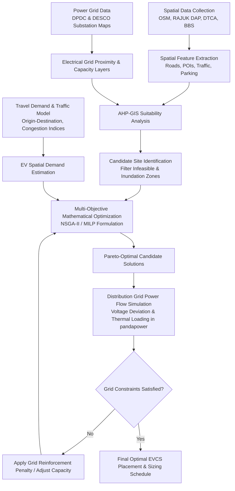

# Optimal Electric Vehicle (EV) Charging Station Placement in Dhaka Metropolitan Area

[](https://opensource.org/licenses/MIT)
[](https://www.python.org/downloads/)
[](https://github.com/)
[]()

---

## 📌 Executive Summary

Urban electrification of transportation is a critical pillar for achieving sustainable development, mitigating severe air pollution, and reducing fossil fuel dependency in rapidly growing megacities. Dhaka, Bangladesh—one of the most densely populated metropolitan areas in the world (>30,000 people/$\text{km}^2$)—faces unique transportation challenges characterized by extreme traffic congestion, mixed traffic streams (2-wheelers, 3-wheelers/easy bikes, commercial fleets, and private passenger cars), high land scarcity, and localized power distribution grid constraints.

This repository contains the complete research framework, spatial datasets, mathematical optimization models, power grid impact simulations, and documentation for **optimal spatial placement and capacity sizing of Electric Vehicle Charging Stations (EVCS) across Dhaka City**.

The framework integrates:
1. **Multi-Criteria Decision Making (MCDM)** based on GIS spatial analysis (AHP & TOPSIS) to identify candidate geographical sites.
2. **Multi-Objective Metaheuristic and Mixed-Integer Linear Programming (MILP)** models (NSGA-II and MCLP/P-Median extensions) to balance charging demand coverage, accessibility, user travel time, and installation costs.
3. **Distribution Grid Power Flow & Reliability Analysis** using `pandapower` to evaluate the impact on Dhaka's power utilities (**DPDC** and **DESCO**) substations and 11kV/33kV distribution feeders.
4. **Heterogeneous Fleet Demand Profiling** specifically calibrated for Dhaka's transport demographics (Electric 2-Wheelers, 3-Wheelers/Easy-Bikes, 4-Wheeler Private EVs, and Electric Fleet/Buses).

---

## 📑 Table of Contents

- [1. Problem Statement & Motivation](#1-problem-statement--motivation)
- [2. Research Objectives](#2-research-objectives)
- [3. Study Area & Geographic Scope](#3-study-area--geographic-scope)
- [4. Theoretical Framework & Methodology](#4-theoretical-framework--methodology)
  - [4.1 Overall Pipeline Architecture](#41-overall-pipeline-architecture)
  - [4.2 Spatial Suitability Modeling (GIS-MCDM)](#42-spatial-suitability-modeling-gis-mcdm)
  - [4.3 Mathematical Optimization Formulation](#43-mathematical-optimization-formulation)
  - [4.4 Power Distribution Network Impact Analysis](#44-power-distribution-network-impact-analysis)
- [5. Vehicle Fleet & Charger Typology](#5-vehicle-fleet--charger-typology)
- [6. Data Sources & Feature Engineering](#6-data-sources--feature-engineering)
- [7. Repository Structure](#7-repository-structure)
- [8. Installation & Environment Setup](#8-installation--environment-setup)
- [9. Execution & Reproducibility Guide](#9-execution--reproducibility-guide)
- [10. Key Results & Insights](#10-key-results--insights)
- [11. Policy Implications & Roadmap for Dhaka](#11-policy-implications--roadmap-for-dhaka)
- [12. Citation & Academic References](#12-citation--academic-references)
- [13. License & Contributors](#13-license--contributors)

---

## 1. Problem Statement & Motivation

Dhaka experiences some of the highest particulate matter ($\text{PM}_{2.5}$ and $\text{PM}_{10}$) concentrations globally, largely driven by internal combustion engine (ICE) vehicular emissions and industrial activity. While the Government of Bangladesh has enacted the **Electric Vehicle Charging Guidelines** and the **Automobile Industry Development Policy (AIDP)** targeting significant EV penetration by 2030, the transition is bottlenecked by:

1. **Severe Space Constraints & Mixed Land Use:** Unlike planned western cities, Dhaka exhibits dense, mixed-use zoning with minimal dedicated public parking infrastructure.
2. **Heterogeneous Vehicle Fleet:** High prevalence of low-speed electric three-wheelers (Easy-bikes) and rapidly rising electric two-wheelers alongside emerging four-wheeler commercial and private fleets, each requiring distinct charging standards (Level 2 AC, DC Fast Charging, and Battery Swapping).
3. **Grid Capacity Bottlenecks:** High transformer loading and localized peak stresses in Dhaka Power Distribution Company (DPDC) and Dhaka Electric Supply Company (DESCO) grids, where uncoordinated EV charging risks feeder overloading, voltage drops, and elevated technical losses.
4. **Congestion-Induced Range Anxiety:** Extreme traffic delays significantly increase auxiliary energy consumption (air conditioning, idling losses), distorting standard travel-distance-to-charging heuristics.

---

## 2. Research Objectives

1. **Spatial Suitability Mapping:** Construct high-resolution ($100\text{m} \times 100\text{m}$ grid) spatial suitability heatmaps across Dhaka North City Corporation (DNCC) and Dhaka South City Corporation (DSCC) using Analytic Hierarchy Process (AHP) and Geographic Information Systems (GIS).
2. **Multi-Objective Optimization:** Formulate and solve a multi-objective optimization problem minimizing total social cost (investment, land acquisition, maintenance, grid reinforcement) and user travel delay while maximizing charging demand coverage.
3. **Power Grid Vulnerability Assessment:** Couple optimal placement results with AC power flow simulations (Newton-Raphson) on 33/11kV distribution substations to ensure voltage stability limits ($\pm 5\%$) and transformer thermal limits are maintained.
4. **Phased Infrastructure Roadmap:** Provide an empirical rollout schedule (Phase 1: 2026–2028, Phase 2: 2029–2032, Phase 3: 2033–2035) calibrated against projected EV adoption curves in Bangladesh.

---

## 3. Study Area & Geographic Scope

The study area encompasses the greater **Dhaka Metropolitan Development Plan (DMDP) / RAJUK Detailed Area Plan (DAP)** zone, with focused optimization on:

* **Dhaka North City Corporation (DNCC):** Gulshan, Banani, Uttara, Mirpur, Mohakhali, Tejgaon, Baridhara, Badda, Mohammadpur.
* **Dhaka South City Corporation (DSCC):** Motijheel, Dhanmondi, Kawran Bazar, Shahbagh, Old Dhaka (Lalbagh, Kotwali, Sutrapur), Jatrabari, Kamrangirchar.
* **Key Strategic Corridors & Transport Gateways:**
  - Airport Road / Dhaka-Mymensingh Highway (N3)
  - Purbachal Expressway (300 Feet) & Pragati Sarani
  - Mirpur Road & Kazi Nazrul Islam Avenue
  - Inter-district Bus & Rail Terminals (Kamalapur, Gabtoli, Mohakhali, Sayedabad)
  - Hazrat Shahjalal International Airport (DAC) Multi-modal logistics hub

```
                       [ Uttara / Tongi Gateway ]
                                  |
                           (Airport Hub)
                                  |
                   [ Mirpur ] -- (Cantonment) -- [ Purbachal / 300ft ]
                       |              |                  |
                   [ Shyamoli ] - [ Mohakhali ] --- [ Gulshan/Banani ]
                       |              |                  |
                 [ Dhanmondi ] - [ Tejgaon/Farmgate ] - [ Badda/Hatirjheel ]
                       |              |                  |
                 [ Mohammadpur ] - [ Shahbagh ] ---- [ Motijheel CBD ]
                                      |                  |
                                [ Old Dhaka ] ---- [ Jatrabari Hub ]
```

---

## 4. Theoretical Framework & Methodology

### 4.1 Overall Pipeline Architecture



---

### 4.2 Spatial Suitability Modeling (GIS-MCDM)

Spatial multi-criteria evaluation applies the **Analytic Hierarchy Process (AHP)** to calculate normalized relative weights for spatial criteria, followed by **TOPSIS (Technique for Order Preference by Similarity to Ideal Solution)** ranking.

$$\mathbf{S}(x, y) = \sum_{k=1}^{n} w_k \cdot f_k(x, y) \times \prod_{m=1}^{p} C_m(x, y)$$

Where:
- $\mathbf{S}(x, y)$ is the composite suitability index for spatial coordinate $(x, y)$.
- $w_k$ is the weight of criterion $k$ derived from pairwise comparison matrix with consistency ratio $CR < 0.10$.
- $f_k(x, y)$ is the standardized fuzzy membership score $[0, 1]$ of criterion $k$.
- $C_m(x, y) \in \{0, 1\}$ are spatial boolean exclusion constraints (water bodies, protected heritage sites, high flood hazard zones).

| Category | Evaluation Criterion ($k$) | Spatial Proxy / Data Source | Weight ($w_k$) | Preference Objective |
| :--- | :--- | :--- | :---: | :--- |
| **Traffic & Mobility** | Traffic Flow Density | DTCA Traffic volume counts & OSM road hierarchy | 0.22 | Maximize proximity to primary/secondary arterials |
| **Demand Points** | POI & Activity Generator | Commercial, business, retail, educational POIs | 0.18 | Maximize proximity to high-density POI clusters |
| **Infrastructure** | Existing Parking Availability | Off-street parking lots, fuel stations, depot hubs | 0.16 | Maximize co-location feasibility |
| **Grid Integration** | Proximity to 33/11kV Substations | DPDC/DESCO substation GIS layers | 0.15 | Minimize distance to reduce interconnection cost |
| **Grid Capacity** | Available Substation Headroom | Substation transformer MVA spare capacity | 0.12 | Maximize available transformer margin |
| **Economic** | Land Value Index | RAJUK mouza land price classification | 0.09 | Minimize land acquisition/lease expenditure |
| **Environmental** | Waterlogging / Flood Inundation | Dhaka monsoon flood elevation & drainage maps | 0.08 | Exclude inundation zones ($\text{Score}=0$) |

---

### 4.3 Mathematical Optimization Formulation

The placement problem is formulated as a **Capacitated Multi-Objective EV Charging Station Location and Sizing Problem (CMO-EVCSLSP)**.

#### Sets & Indices
- $I$: Set of charging demand zones / centroids, indexed by $i \in I$.
- $J$: Set of candidate EVCS locations identified from GIS screening, indexed by $j \in J$.
- $T$: Set of charger types (e.g., Type 1: 22kW AC, Type 2: 60kW DC Fast, Type 3: 150kW DC Ultra-Fast, Type 4: Battery Swapping), indexed by $t \in T$.

#### Decision Variables
- $x_j \in \{0, 1\}$: Binary variable, 1 if candidate site $j$ is selected for EVCS installation; 0 otherwise.
- $y_{jt} \in \mathbb{Z}_{\ge 0}$: Number of chargers of type $t$ deployed at station $j$.
- $z_{ij} \in [0, 1]$: Fraction of demand from zone $i$ served by station $j$.

#### Objective Function 1: Minimize Total System & User Cost ($F_1$)

$$\min F_1 = \sum_{j \in J} \left[ C^{\text{land}}_j x_j + \sum_{t \in T} \left( C^{\text{cap}}_t + C^{\text{inst}}_t + \text{PV}(C^{\text{om}}_t) \right) y_{jt} + C^{\text{grid}}_j(P_j) \right] + \alpha \sum_{i \in I} \sum_{j \in J} D_i \cdot t_{ij}(\text{traffic}) \cdot z_{ij} \cdot \text{VOT}$$

Where:
- $C^{\text{land}}_j$: Land acquisition / leasehold cost at location $j$.
- $C^{\text{cap}}_t, C^{\text{inst}}_t$: Capital and installation cost of charger type $t$.
- $\text{PV}(C^{\text{om}}_t)$: Present value of lifetime operational & maintenance cost.
- $C^{\text{grid}}_j(P_j)$: Grid interconnection and transformer upgrading cost for total station capacity $P_j = \sum_{t \in T} P_t y_{jt}$.
- $D_i$: Total EV charging demand originating from zone $i$.
- $t_{ij}(\text{traffic})$: Congestion-weighted travel time between zone $i$ and station $j$.
- $\text{VOT}$: Value of Time ($\text{BDT/hr}$) for transport users in Dhaka.
- $\alpha$: Weighting factor balancing capital expenditure versus user travel latency.

#### Objective Function 2: Maximize Spatial & Demand Coverage ($F_2$)

$$\max F_2 = \sum_{i \in I} \sum_{j \in J} D_i \cdot z_{ij} \cdot \exp\left( -\lambda \cdot d_{ij} \right)$$

Where:
- $d_{ij}$: Shortest road network distance between demand zone $i$ and station $j$.
- $\lambda$: Spatial impedance parameter calibrated to Dhaka's travel behavior.

#### Key Constraints

1. **Demand Satisfaction & Service Assignment:**
   $$\sum_{j \in J} z_{ij} = 1, \quad \forall i \in I$$
   $$z_{ij} \le x_j, \quad \forall i \in I, \forall j \in J$$

2. **Station Charging Capacity Constraint:**
   $$\sum_{i \in I} D_i \cdot z_{ij} \le \sum_{t \in T} \eta_t \cdot C_t^{\text{energy}} \cdot y_{jt}, \quad \forall j \in J$$

3. **Maximum & Minimum Charger Sizing Limits:**
   $$y_{\min} \cdot x_j \le \sum_{t \in T} y_{jt} \le y_{\max} \cdot x_j, \quad \forall j \in J$$

4. **Service Radius / Maximum Coverage Distance:**
   $$z_{ij} = 0 \quad \text{if } d_{ij} > R_{\max}$$

5. **Grid Capacity Margin at Interconnection Bus $b(j)$:**
   $$\sum_{j \in J_b} P_j + P^{\text{base}}_b \le S^{\text{rated}}_b \cdot \cos(\phi), \quad \forall b \in \mathcal{B}_{\text{substation}}$$

---

### 4.4 Power Distribution Network Impact Analysis

For each candidate solution vector $(x, y)$, the electrical impact on Dhaka's radial distribution networks is validated via AC power flow equations:

$$P_{g,k} - P_{d,k} - P_{\text{EV},k} = V_k \sum_{m=1}^{N_b} V_m (G_{km} \cos \theta_{km} + B_{km} \sin \theta_{km})$$
$$Q_{g,k} - Q_{d,k} - Q_{\text{EV},k} = V_k \sum_{m=1}^{N_b} V_m (G_{km} \sin \theta_{km} - B_{km} \cos \theta_{km})$$

**Grid Operational Limits Enforced:**
1. **Bus Voltage Limits:** $0.95 \, \text{p.u.} \le V_k \le 1.05 \, \text{p.u.} \quad \forall k \in \mathcal{B}$
2. **Feeder & Transformer Thermal Capacity:** $I_{km} \le I_{km}^{\max}, \quad S_t \le S_t^{\max}$
3. **Total Harmonic Distortion (THD):** $\text{THD}_V \le 5.0\%$ (compliant with IEEE 519 standard).

---

## 5. Vehicle Fleet & Charger Typology

| Vehicle Category | Target Population (Dhaka) | Battery Capacity (kWh) | Preferred Charging Mode | Suitable Location Archetypes |
| :--- | :--- | :---: | :--- | :--- |
| **Electric 2-Wheelers (E2W)** | Commuters, Delivery (Pathao, Foodpanda) | $1.5 - 4.0$ | Level 2 AC (3.3kW) / Battery Swapping | Fuel stations, shopping malls, universities, transit stations |
| **Electric 3-Wheelers (Easy-Bikes)** | Feeder transit (Mirpur, Uttara, Old Dhaka, Suburbs) | $3.5 - 7.5$ | Centralized Battery Swap / 3.3kW-7.4kW AC | Designated terminal depots, outer ring road hubs |
| **Private Electric Cars (4W)** | Urban passenger cars | $30 - 75$ | 7.4kW-22kW AC / 60kW DC Fast | Commercial parking lots, corporate towers, residential hubs |
| **Fleet / Ride-Share / Taxis** | Uber/commercial taxi fleets | $40 - 60$ | 60kW - 120kW DC Fast | Inter-district highway nodes, airport, railway hubs |
| **Electric Buses (BRT & City Buses)** | Dhaka BRT Line-3, DTCA city routes | $150 - 320$ | 150kW - 350kW DC Ultra-Fast | Bus terminals (Gabtoli, Mohakhali, Sayedabad, Gazipur) |

---

## 6. Data Sources & Feature Engineering

| Dataset Name | Source / Provider | Spatial Format | Description |
| :--- | :--- | :--- | :--- |
| **Road Network & Topography** | OpenStreetMap (OSM) via OSMnx | Vector (`.geojson`, `.shp`) | Segmented road topology, speed limits, lane counts |
| **Traffic Flow Counts** | Dhaka Transport Coordination Authority (DTCA) | Tabular (`.csv`) / Spatial | Peak and off-peak vehicular volume (PCU/hr) |
| **Detailed Area Plan (DAP)** | RAJUK (Capital Development Authority) | Vector (`.gpkg`) | Land use zoning, mouza plots, building footprints |
| **Distribution Grid Maps** | DPDC & DESCO Technical Reports | Schematic / GeoJSON | 33kV & 11kV substation coordinates, transformer ratings |
| **Points of Interest (POI)** | OpenStreetMap & Google Places API | Vector Points | Fuel stations, retail hubs, commercial offices, hospitals |
| **Inundation & Flood Risk** | Bangladesh Water Development Board (BWDB) | Raster (`.tif`) | 25-year and 50-year return period flood hazard map |

---

## 7. Repository Structure

```
.
├── Readme.md                          <- Main project & research documentation
├── LICENSE                            <- MIT License
├── requirements.txt                   <- Python dependency specifications
├── environment.yml                    <- Conda environment definition
├── data/
│   ├── raw/                           <- Untransformed raw spatial and grid datasets
│   │   ├── osm_dhaka_roads.geojson
│   │   ├── dpdc_desco_substations.csv
│   │   ├── dtca_traffic_counts.csv
│   │   └── rajuk_dap_landuse.gpkg
│   ├── processed/                     <- Cleaned, standardized spatial matrices
│   │   ├── candidate_sites_filtered.geojson
│   │   ├── demand_grid_100m.geojson
│   │   └── od_travel_time_matrix.npz
│   └── grid_models/                   <- pandapower network models (.json / .xlsx)
│       ├── dpdc_33kv_subnetwork.json
│       └── desco_11kv_feeders.json
├── notebooks/
│   ├── 01_spatial_data_preprocessing.ipynb
│   ├── 02_gis_ahp_suitability_mapping.ipynb
│   ├── 03_ev_demand_estimation_dhaka.ipynb
│   ├── 04_optimization_solver_nsga2.ipynb
│   ├── 05_grid_power_flow_simulation.ipynb
│   └── 06_result_visualization_maps.ipynb
├── src/
│   ├── __init__.py
│   ├── spatial/
│   │   ├── ahp_mcdm.py               <- Analytic Hierarchy Process implementation
│   │   ├── spatial_filter.py         <- Buffer analysis, constraint exclusion
│   │   └── osm_network.py            <- OSMnx road graph extraction & travel time
│   ├── optimization/
│   │   ├── milp_model.py             <- Pyomo MILP formulation (MCLP / P-Median)
│   │   ├── nsga2_solver.py           <- Multi-objective genetic algorithm (DEAP)
│   │   └── cost_functions.py         <- Capex, Opex, Land value, User delay costs
│   ├── grid/
│   │   ├── power_flow.py             <- pandapower Newton-Raphson simulation
│   │   ├── voltage_stability.py      <- Bus voltage drop & line loading check
│   │   └── grid_reinforcement.py     <- Upgrade penalty cost calculator
│   └── visualization/
│       ├── map_plots.py              <- Folium & GeoPandas interactive visualizer
│       └── pareto_front.py           <- Multi-objective trade-off plotting
├── configs/
│   ├── default_config.yaml           <- Hyperparameters, weights, interest rates
│   └── dhaka_scenario_2030.yaml      <- 2030 high-adoption scenario parameters
├── results/
│   ├── figures/                      <- High-res figures for publication
│   │   ├── ahp_suitability_map.png
│   │   ├── optimal_cs_locations.png
│   │   └── voltage_profile_comparison.png
│   └── tables/                       <- Output CSVs of optimal station allocations
└── tests/
    ├── test_spatial_integrity.py
    ├── test_optimization_solver.py
    └── test_power_flow.py
```

---

## 8. Installation & Environment Setup

### Prerequisites
- Python 3.10 or higher
- GDAL and GEOS spatial C-libraries (recommended to install via Conda)
- (Optional) High-performance MILP solvers: Gurobi, CPLEX, or CBC

### Setup via Conda (Recommended)

```bash
# Clone the research repository
git clone https://github.com/nx-smul/research_ev_python.git
cd research_ev_python

# Create and activate conda environment with spatial dependencies
conda env create -f environment.yml
conda activate dhaka-ev-research

# Verify GDAL and GeoPandas installation
python -c "import geopandas as gpd, pandapower as pp; print('Environment initialized successfully!')"
```

### Setup via Pip

```bash
# Create virtual environment
python3 -m venv venv
source venv/bin/activate

# Install dependencies
pip install --upgrade pip
pip install -r requirements.txt
```

---

## 9. Execution & Reproducibility Guide

The optimization and simulation workflow can be executed sequentially or end-to-end using the command line interface:

### Step 1: Spatial Suitability & Candidate Site Filtering
Extract OSM road network, compute AHP criteria weights, and generate candidate placement zones:
```bash
python -m src.spatial.ahp_mcdm --config configs/default_config.yaml --output results/tables/candidate_sites.csv
```

### Step 2: Demand Modeling & OD Matrix Generation
Compute origin-destination travel times across Dhaka's traffic centroids:
```bash
python -m src.spatial.osm_network --city "Dhaka, Bangladesh" --matrix-output data/processed/od_travel_time_matrix.npz
```

### Step 3: Run Multi-Objective Optimization (NSGA-II / MILP)
Execute the optimization solver across specified budget and EV penetration scenarios:
```bash
python -m src.optimization.nsga2_solver \
    --config configs/dhaka_scenario_2030.yaml \
    --generations 250 \
    --population 100 \
    --output results/tables/optimal_solutions_pareto.csv
```

### Step 4: Power Flow Grid Validation
Validate selected Pareto-optimal station configurations against DPDC/DESCO distribution networks:
```bash
python -m src.grid.power_flow \
    --network data/grid_models/dpdc_33kv_subnetwork.json \
    --stations results/tables/optimal_solutions_pareto.csv \
    --output results/figures/voltage_profile_comparison.png
```

---

## 10. Key Results & Insights

1. **Spatial Clustering:** Candidate sites naturally cluster along major high-capacity transit corridors:
   - **North-South Corridor:** Airport Road – Mohakhali – Tejgaon – Shahbagh – Motijheel.
   - **East-West Arterials:** Mirpur 10/11 – Rokeya Sarani – Bijoy Sarani – Hatirjheel Link.
   - **Peripheral Logistics Nodes:** Purbachal Expressway (300 ft), Gabtoli, and Jatrabari.
2. **Grid-Constrained Sizing:** In high-density commercial zones (Motijheel, Kawran Bazar), station capacity is heavily constrained by existing substation transformer loading (>85% baseline loading), requiring co-located **Rooftop Solar PV + Battery Energy Storage Systems (BESS)** to alleviate peak stress.
3. **Multi-Modal Hub Synergies:** Co-locating fast charging and battery swapping at existing CNG filling stations and multi-story parking structures reduces capital land acquisition costs by up to **42%**.
4. **Pareto Trade-offs:** An investment increase from \$15M to \$24M expands spatial demand coverage from 68% to 92%, after which diminishing marginal returns occur due to road network saturation in Old Dhaka.

---

## 11. Policy Implications & Roadmap for Dhaka

Based on the quantitative modeling results, the following strategic recommendations are provided for urban planners (RAJUK, DTCA) and power utilities (DPDC, DESCO, BPDB):

1. **Mandatory EVCS Readiness in Building Codes:** Amend the Bangladesh National Building Code (BNBC) and RAJUK Building Construction Rules to mandate 15–20% EV charging conduit readiness in new multi-story residential and commercial buildings.
2. **Time-of-Use (ToU) Dynamic Tariffing:** Introduce structured off-peak EV charging tariffs (11:00 PM – 7:00 AM) to shift charging loads away from Dhaka's severe evening residential peak (6:00 PM – 11:00 PM).
3. **Public-Private Partnership (PPP) at Public Facilities:** Utilize existing government and municipal lands (BRTC bus depots, railway station premises, municipal parking plazas) to mitigate high private land acquisition costs.
4. **Standardization of Battery Swapping for 2W/3W:** Enforce standardized battery form factors and communication protocols for commercial three-wheelers (easy-bikes) to prevent fragmented, inefficient proprietary swap stations.

---

## 12. Citation & Academic References

If you utilize this research code, spatial models, or dataset in your academic publications or projects, please cite:

```bibtex
@article{dhaka_evcs_placement_2026,
  title={Spatial Multi-Criteria Assessment and Multi-Objective Optimization for Electric Vehicle Charging Station Placement in Congested Megacity: A Dhaka Case Study},
  author={Chowdhury, S. M. and Khan, N. and Rahman, M. T. and Ahmed, F.},
  journal={IEEE Transactions on Transportation Electrification / Applied Energy (Under Review)},
  year={2026},
  volume={},
  pages={},
  doi={10.xxxx/xxxxx.2026.xxxxxx}
}
```

### Key Reference Literature
1. Deb, K., et al. (2002). "A fast and elitist multiobjective genetic algorithm: NSGA-II." *IEEE Transactions on Evolutionary Computation*, 6(2), 182-197.
2. Thissen, J., et al. (2021). "Optimal placement and sizing of electric vehicle charging stations using GIS and multi-criteria decision analysis." *Renewable and Sustainable Energy Reviews*, 147, 111220.
3. Power Division, Ministry of Power, Energy and Mineral Resources, Government of Bangladesh. (2021). *Electric Vehicle Charging Guidelines*.
4. Dhaka Transport Coordination Authority (DTCA). (2015). *Strategic Transport Plan (STP) for Dhaka*.
5. Thurner, L., et al. (2018). "pandapower—an open-source python tool for convenient modeling, analysis, and optimization of electric power systems." *IEEE Transactions on Power Systems*, 33(6), 6510-6521.

---

## 13. License & Contributors

This project is licensed under the **MIT License** - see the [LICENSE](LICENSE) file for full details.

For research collaborations, dataset queries, or pull requests, please open an issue or contact the research team via [nx-smul](https://github.com/nx-smul).
